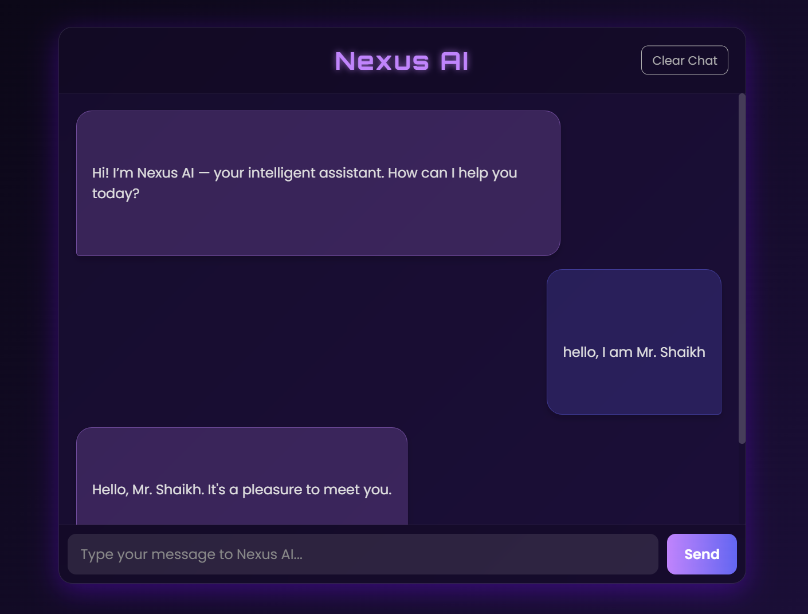

# Nexus AI Chatbot

Nexus AI is a sleek and responsive web-based chatbot powered by the Google Gemini API. It provides a modern and intuitive interface for interacting with the powerful Gemini language models.

  <!-- Replace with a screenshot of your application -->

## Features

*   **Real-time Conversation:** Engage in natural and dynamic conversations with the Gemini AI.
*   **Session-based Chat History:** Your conversation is saved in your session, allowing you to pick up where you left off.
*   **Clear Chat:** Easily start a new conversation by clearing the chat history.
*   **Responsive Design:** The chat interface is designed to work seamlessly on both desktop and mobile devices.
*   **Model Selection:** The application can be configured to use different Gemini models. A utility script is included to list available models.

## Technologies Used

*   **Backend:** Python, Flask
*   **Frontend:** HTML, CSS, JavaScript
*   **API:** Google Gemini API
*   **Python Dependencies:**
    *   `google-generativeai`
    *   `flask`
    *   `python-dotenv`

## Installation

1.  **Clone the repository:**
    ```bash
    git clone https://github.com/YOUR_USERNAME/nexus-ai.git
    cd nexus-ai
    ```

2.  **Create a virtual environment and activate it:**
    ```bash
    python -m venv venv
    # On Windows
    venv\Scripts\activate
    # On macOS/Linux
    source venv/bin/activate
    ```

3.  **Install the required dependencies:**
    ```bash
    pip install -r requirements.txt
    ```

4.  **Set up your API key:**
    *   Create a file named `.env` in the root of the project.
    *   Add your Gemini API key to the `.env` file:
        ```
        GEMINI_API_KEY=YOUR_API_KEY
        ```
    *   You can also optionally specify a Gemini model to use:
        ```
        GEMINI_MODEL=gemini-pro
        ```

## Usage

1.  **Run the Flask application:**
    ```bash
    python app.py
    ```

2.  **Access the chatbot in your browser:**
    Open your web browser and navigate to `http://127.0.0.1:5000`.

3.  **List available models (optional):**
    To see a list of available Gemini models that you can use, run the `list_models.py` script:
    ```bash
    python list_models.py
    ```

## Contributing

Contributions are welcome! If you have any ideas, suggestions, or bug reports, please open an issue or submit a pull request.

1.  Fork the repository.
2.  Create a new branch (`git checkout -b feature/your-feature`).
3.  Make your changes.
4.  Commit your changes (`git commit -m 'Add some feature'`).
5.  Push to the branch (`git push origin feature/your-feature`).
6.  Open a pull request.

## License

This project is licensed under the MIT License. See the [LICENSE](LICENSE) file for details.
#
